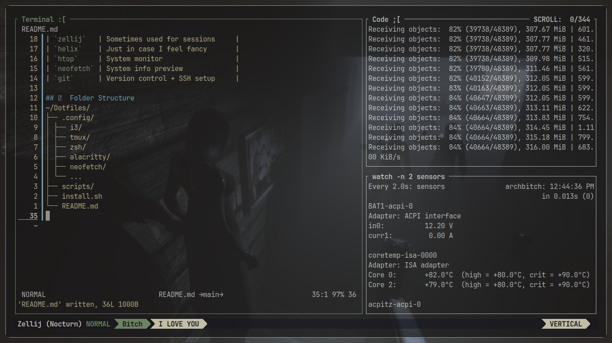

# 🌿 My Dotfiles 

## ✨ Features

- **Window Manager**: i3 / Sway (Tiling + efficient)
- **Terminal**: Alacritty / Kitty / Foot
- **Shell**: zsh with Oh My Zsh + Powerlevel10k
- **Multiplexer**: tmux with custom status bar
- **Editor**: (Pan / Vim / Helix depending on mood)
- **Extras**: neofetch, htop, btop, custom scripts, SFML/C++ dev setup

## 🧰 Tools

| Tool       | Description                     |
|------------|---------------------------------|
| `zsh`      | Shell with aliasing & theme     |
| `zellij`   | Sometimes used for sessions     |
| `helix`    | Just in case I feel fancy       |
| `htop`     | System monitor                  |
| `neofetch` | System info preview             |
| `git`      | Version control + SSH setup     |

## 📁 Folder Structure
~/Dotfiles/
├── .config/
│ ├── i3/
│ ├── tmux/
│ ├── zsh/
│ ├── alacritty/
│ ├── neofetch/
│ └── ...
├── scripts/
├── install.sh
└── README.md

